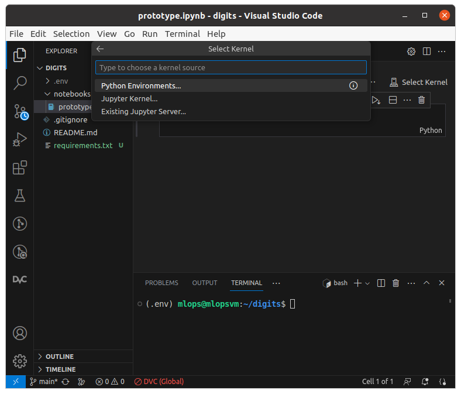

# Prototyp ML-Experiment

Wir haben ein Jupyter-Notebook mit dem Prototypen erstellt. Du solltest dieses Notebook in deinem Repository unter `notebooks/prototype.ipynb` finden.

Damit du das Notebook in VSCode ausführen kannst, musst du die Python-Umgebung konfigurieren. Danach kannst du entweder mit `Run All` alle Codeabschnitte oder mit dem Pfeil links neben dem Codeabschnitt den einzelnen Abschnitt ausführen.

1. Die Datei `notebooks/prototype.ipynb` öffnen.
1. Die erstellte Python-Umgebung wie folgt konfigurieren:
    1. Oben rechts _Select Kernel_ wählen.   
        
    1. Im Menü _Python Environments..._ klicken:   
        
    1. In GitHub Codespace solltest du nur ein vorhandenes Python 3.x sehen, wähle dieses aus (arbeitest du in einer lokalen Umgebung, dann wähle das vorher erstellte Environment `.env`):
        
1. Codeabschnitte ausführen
    * Alle gemeinsam ausführen:  
        

    * Einzelner Abschnitt ausführen

        Logischerweise müssen die Abschnitte in der gegebenen Reihenfolge ausgeführt werden, da sonst die Abhängigkeiten nicht gegeben sind.
        
        

    * Du kannst eine Zelle auch mit `SHIFT+ENTER` ausführen und springst danach direkt weiter zur nächsten Zelle. Willst du eine Zelle mehrmals hintereinander ausführen, kannst du `CTRL+ENTER` benutzen.

## Ausführung Befehle im Terminal

Teste bitte, ob die folgenden Befehle im Terminal funktionieren:

```shell
python3 src/data_load.py --config params.yaml
python3 src/data_prepare.py --config params.yaml
python3 src/data_split.py --config params.yaml
python3 src/train.py --config params.yaml
python3 src/evaluate.py --config params.yaml
```

---

[← Umgebung vorbereiten](001_lab_environment.md) | [STARTSEITE](../README.md) |
[Pipeline zusammenstellen →](020_lab_init_pipeline.md)
